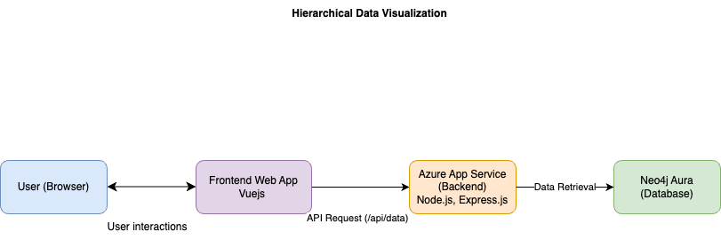

# Hierarchical Data Visualization Project

## Overview

This project visualizes hierarchical data, demonstrating parent-child relationships between nodes. It consists of a Vue.js 2 frontend and a Node.js backend. The data is stored and retrieved from a Neo4j Aura cloud instance.

## Features

-   **Hierarchical Visualization:** Clear graphical representation of parent-child relationships.
-   **Interactive Nodes:** Clickable nodes with detailed descriptions displayed in a popup.
-   **Data Fetching:** Real-time data retrieval from a Neo4j database via a RESTful API.

## Technologies Used

-   **Frontend:**
    -   Vue.js 2
    -   D3.js library(for visualization)
-   **Backend:**
    -   Node.js
    -   Express.js
    -   Neo4j (graph database)
-   **Deployment:**
    -   Netlify (frontend hosting)
    -   Azure App Service (backend hosting)
    -   Neo4j Aura (cloud database)

## Setup Instructions

### Prerequisites

-   Node.js (LTS version recommended)
-   npm (or yarn, pnpm)
-   Vue CLI (if using Vue CLI commands)
-   Docker (if using Docker for local development)

### Installation

1.  **Clone the repository:**

    ```bash
    git clone https://github.com/Dhilip0718/graph-data.git
    cd graph-data
    ```

2.  **Install dependencies for node:**
    cd graph-data/packages/server
    ```bash
    npm install
   
    ```
3. **Install dependencies:**
    cd graph-data

    ```bash
    npm install
    ```

### Development

1.  **Start the development server:**

    ```bash
    npm run server
    npm run serve

    The application will be available at `http://localhost:8080/` (or the port specified by Vue CLI).

    The application will start the server at `http://localhost:3000/api/data`


### Production

1.  **Build for production:**

    ```bash
    npm run build
    # or
    yarn build
    # or
    pnpm build
    ```

    The production build will be located in the `dist` directory.


## Deployment

-   **Frontend:** Hosted on Netlify.
-   **Backend:** Hosted on Azure App Service.
-   **Database:** Neo4j Aura cloud instance.

## API Endpoints (Backend)

-   `/api/data`: Retrieves hierarchical data from the Neo4j database.


## Project Landscape

Here's a visual representation of the project Landscape:



## Author

Dhilip Rk